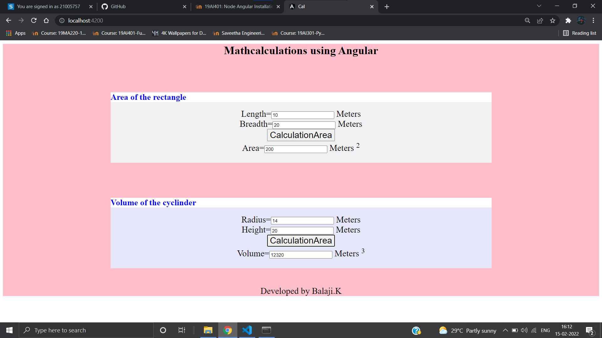

# AngularCalculation

# Web Page for Mathematical Calculations using Angular

## AIM:
To design a dynamic website to perform mathematical calculations using Angular Framwork

## DESIGN STEPS:

### Step 1:

Requirement collection.

### Step 2:

Creating the layout using HTML and CSS in component.html file

### Step 3:

Write typescript to perform the calculations.

### Step 4:

Validate the layout in various browsers.

### Step 5:

Validate the HTML code.

### Step 6:

Publish the website in the given URL.

## PROGRAM :
### Cylinder:
#### cylinder.component.html:
```
<div class="content">
    <h2>
        Volume of the cyclinder
    </h2>
    <div class="id">
        Radius=<input type="text"[(ngModel)]="radius"> Meters<br/>
        Height=<input type="text"[(ngModel)]="height"> Meters<br/>
        <input class="id" type="button" (click)="oncalculate() "value="CalculationArea"><br/>
        Volume=<input type="text" [value]="volume" readonly> Meters <sup>3</sup><br/>
    </div>
</div>
<style>
    h2{
background-color: white;
color: blue;
}
.content {
  display: block;
  width: 100%;
  background-color: #E6E6FA;
  min-height: 200px;
  margin-top: 100px;
}
.id{
    text-align: center;
    font-size: 25px;
}

</style>
```
#### cylinder.component.ts:
```
import { Component } from "@angular/core";

@Component({
    selector:'Cyclinder-volume',
    templateUrl:'./cyclinder.component.html'
})
export class Cyclindercomponent{
    radius:number;
    height:number;
    volume:number;
    constructor(){
        this.height=0;
        this.radius=0;
        this.volume=22/7*this.radius*this.radius*this.height;
    }
    oncalculate(){
        this.volume=22/7*this.radius*this.radius*this.height

    }
}
```
### Rectangle:
#### rectangle.component.html:
```
<div class="content">
    <h2>
        Area of the rectangle
    </h2>
    <div class="id">
        Length=<input type="text"[(ngModel)]="length"> Meters<br/>
        Breadth=<input type="text"[(ngModel)]="breadth"> Meters<br/>
        <input class="id" type="button" (click)="onCalculate() "value="CalculationArea"><br/>
        Area=<input type="text" [value]="area" readonly> Meters <sup>2</sup><br/>
    </div>
</div>
<style>
    h2{
background-color: white;
color: blue;
}
.content {
  display: block;
  width: 100%;
  background-color: #f1f1f3;
  min-height: 200px;
  margin-top: 100px;
}
.id{
    text-align: center;
    font-size: 25px;
}

</style>
```
#### rectangle.component.ts:
```
import { Component } from "@angular/core";

@Component({
    selector:'Rectangle-Area',
    templateUrl:'./rectangle.component.html'
})
export class RectangleComponent{
    length:number;
    breadth:number;
    area:number;
    constructor(){
        this.length=0;
        this.breadth=0;
        this.area= this.length * this.breadth;
    }
    onCalculate(){
        this.area = this.length * this.breadth
    }
}
```
### app.component.css:
```
h1{
    text-align: center;
    color:black;
    margin-top: 10px;
}
.container {
    width: 1080px;
    margin-left: auto;
    margin-right: auto;
  }
  .id2{
    background:pink;
}
  footer{
      text-align: center;
      font-size: 25px;
      color: white
      background-color blue;
      margin-top: 50px;
  }
```
### app.component.html:
```
<div class="id2">
  <h1>Mathcalculations using Angular</h1>
  <div class="container">
  
  <Rectangle-Area></Rectangle-Area>
  <Cyclinder-volume></Cyclinder-volume>
  </div>
  
  <footer> Developed by Balaji.K</footer>
  </div>
```
### app.component.ts:
```
import { Component } from '@angular/core';

@Component({
  selector: 'app-root',
  templateUrl: './app.component.html',
  styleUrls: ['./app.component.css']
})
export class AppComponent {
  title = 'cal';
}

```
### app.module.ts:
```
import { NgModule } from '@angular/core';
import { FormsModule } from '@angular/forms';
import { BrowserModule } from '@angular/platform-browser';

import { AppComponent } from './app.component';
import { Cyclindercomponent } from './cyclinder/cyclinder.component';
import { RectangleComponent } from './rectangle/rectangle.component';

@NgModule({
  declarations: [
    AppComponent,RectangleComponent,Cyclindercomponent
  ],
  imports: [
    BrowserModule,FormsModule
  ],
  providers: [],
  bootstrap: [AppComponent]
})
export class AppModule { }
```
## OUTPUT:



## Result:
To design a dynamic website to perform mathematical calculations using Angular Framwork is successfully created.